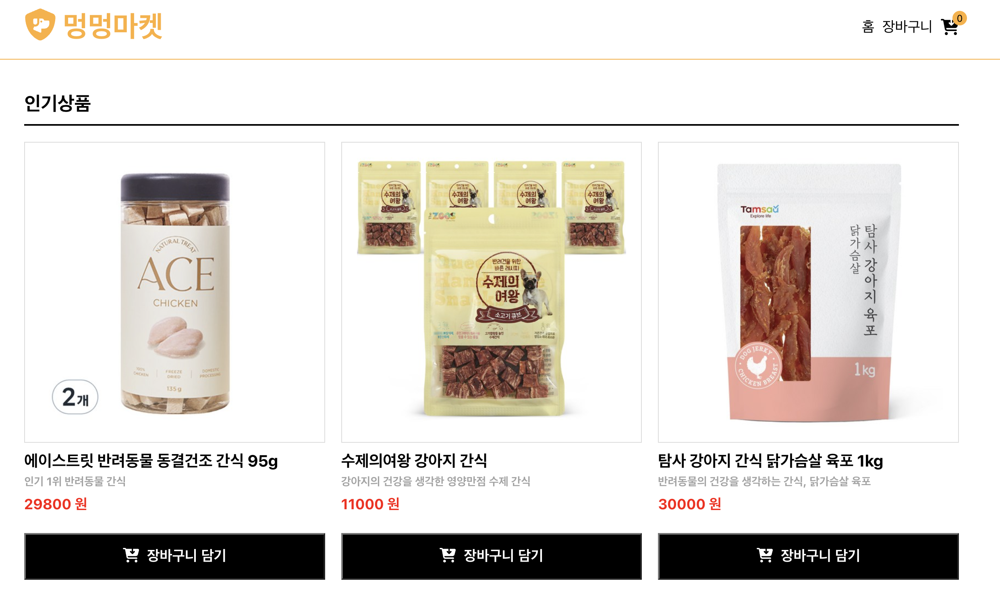

# 🐶 Shopping Cart Project 🛒
- 강아지 간식이나 장난감을 살 수 있는 쇼핑몰입니다. 원하는 물품을 장바구니에 담아보세요!
- [🌐 멍멍마켓 웹사이트로 바로가기](https://clever-meerkat-59ecf3.netlify.app/)
 

 

### 📅 프로젝트 기간 
- 2023.09.28 ~ 2023.10.11

 

### ⭐︎ Front-end 기술선정

#### React + Typescript
- 자바스크립트 라이브러리인 리액트를 중심으로 개발

#### Redux
- 페이지에서 관리해야하는 상태가 많아지고 구조가 복잡해지면서 상태관리 시  
props 사용이 부담스러웠고, state 갱신에 관한 에러를 방지하기 위해 Redux를 사용

 

### 💻️ 프론트엔드 기술 스택

  

 

### 🔧 주요 기능
- 장바구니 담기 및 카트에 수량 표시
- 물품 추가,감소 버튼
- 물품 가격 계산

